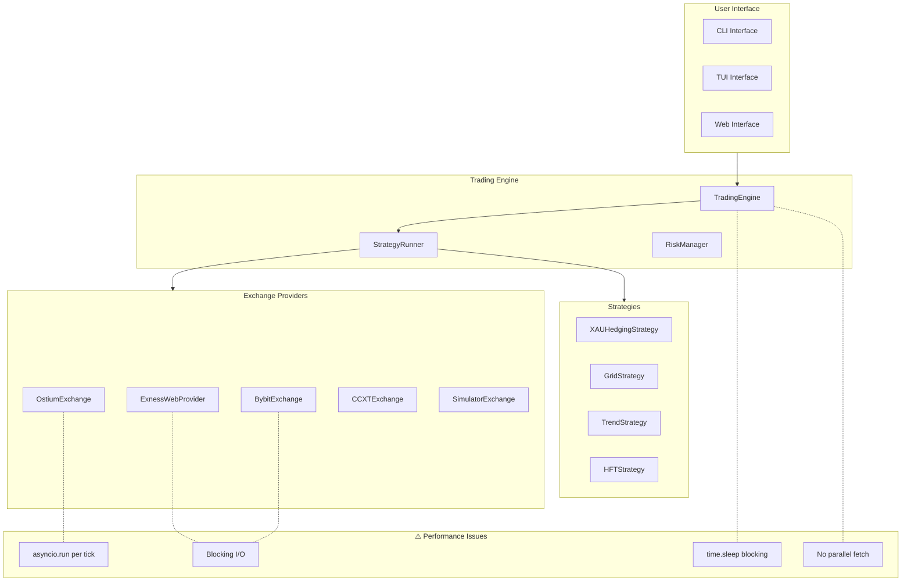
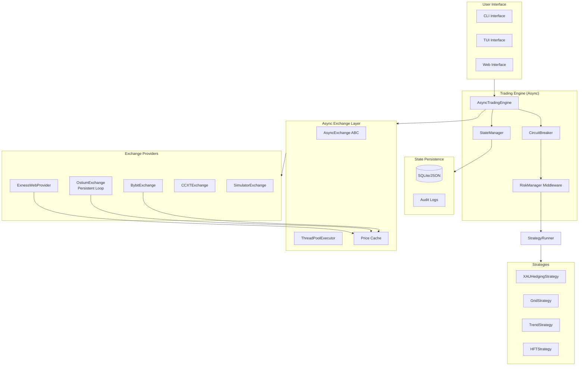
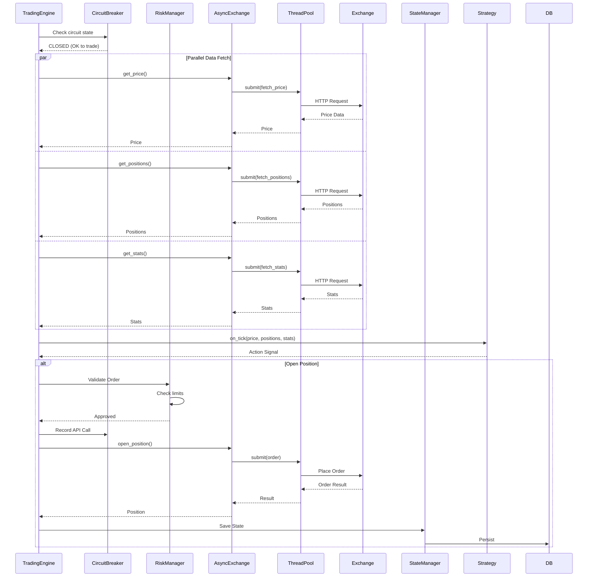
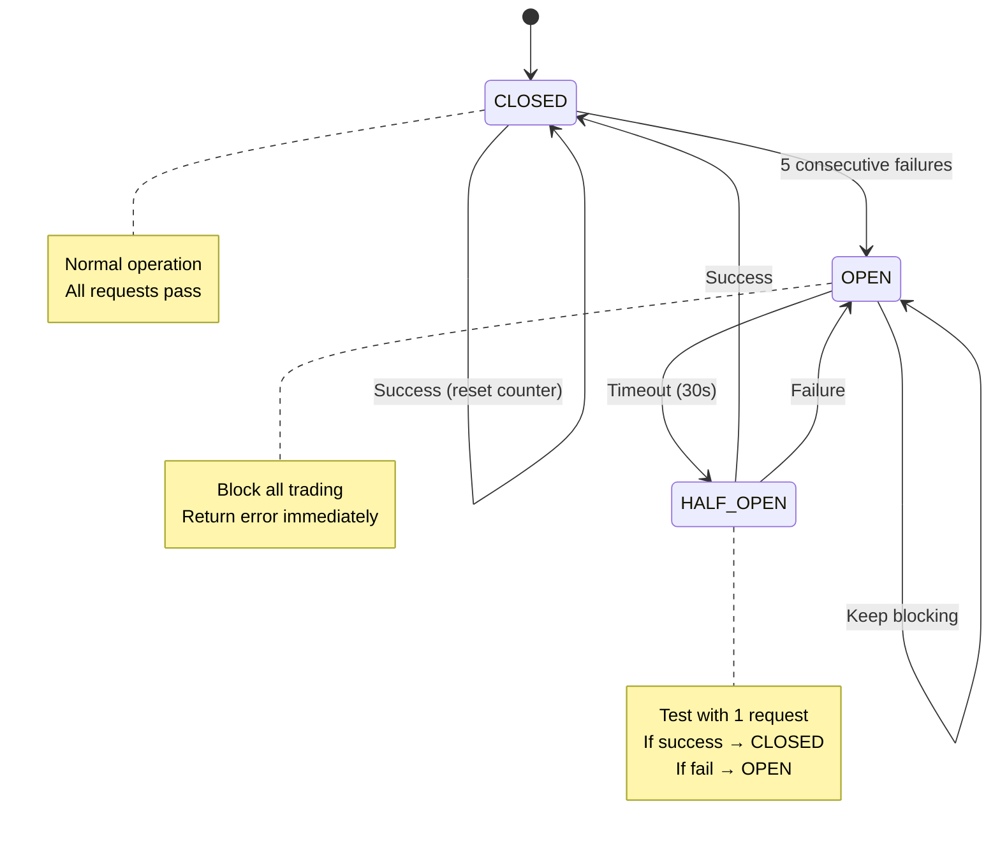
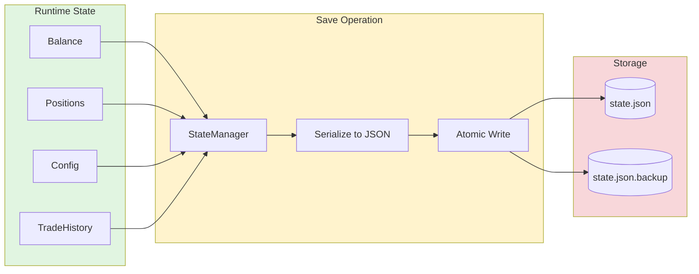
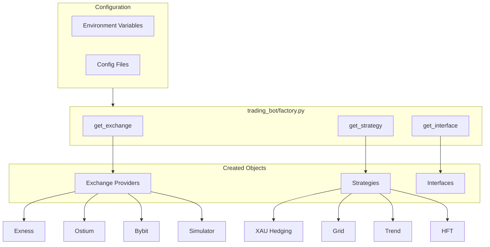
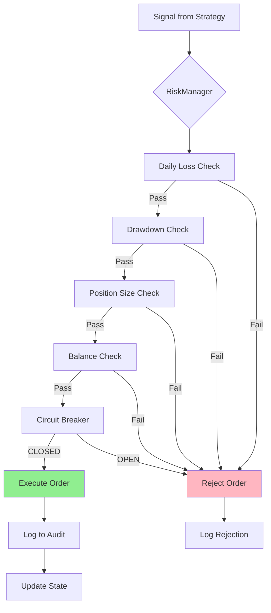
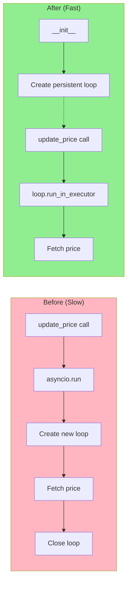

# HFT Trading Bot - Component Interaction Diagrams

## 1. Current Architecture (Before Improvements)

## 2. Target Architecture (After Improvements)

## 3. Async Data Flow (Improved)

## 4. Circuit Breaker State Machine

## 5. State Persistence Flow

## 6. Factory Pattern (Post-Refactor)

## 7. Risk Management Flow

## 8. Ostium Async Fix (Detail)

## Legend

- **Green boxes**: New/improved components
- **Red boxes**: Problem areas
- **Yellow boxes**: Intermediate processing
- **Solid arrows**: Synchronous calls
- **Dashed arrows**: Async/concurrent calls
- **Par blocks**: Parallel execution
